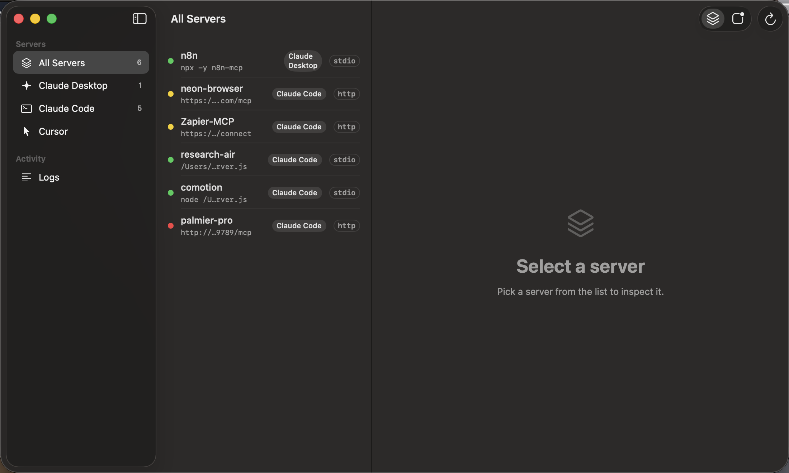
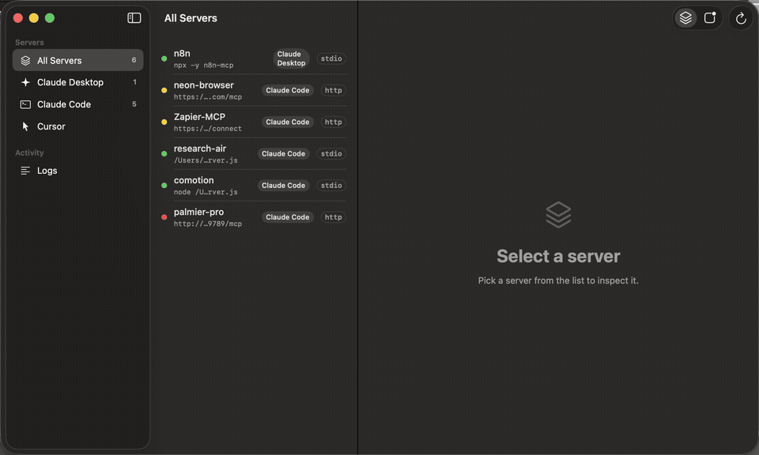

<p align="center">
  
</p>

<h1 align="center">MCP Deck</h1>

<p align="center">
  A native macOS menu bar dashboard for your MCP servers.<br>
  See every server configured across your AI clients, health-check them, and toggle them on and off — without ever hand-editing JSON.
</p>

<p align="center">
  <a href="LICENSE"></a>
  
  
  <a href=".github/workflows/ci.yml"></a>
</p>



## Why

[MCP](https://modelcontextprotocol.io) servers end up configured in JSON files scattered across every AI client on your machine — Claude Desktop, Claude Code, Cursor… There is no way to see at a glance which servers are running, which are broken, and which are silently waiting for you to re-authenticate. MCP Deck fixes that:

- 🗂 **One dashboard** for every MCP server on your machine, grouped by server or by client.
- 🩺 **Real health checks** — MCP Deck speaks the actual protocol: it spawns/contacts the server, runs the JSON-RPC `initialize` handshake, and lists the tools the server exposes.
- 🔐 **Auth detection** — HTTP servers answering 401/403 show up as “auth required” instead of a generic failure.
- 🎛 **Enable/disable per client** without losing the entry: the definition moves to a `_disabled_mcpServers` key in the same file and comes back intact.
- 📜 **Live logs** — follow Claude Desktop’s MCP logs in real time, filtered by server.
- 🚦 **Menu bar status** — the icon carries a badge whenever a server is failing or needs auth.



## Supported clients

| Client | Config scanned | Enable/disable |
|---|---|---|
| **Claude Desktop** | `~/Library/Application Support/Claude/claude_desktop_config.json` | ✅ |
| **Claude Code** | `~/.claude.json` (global + per-project) and each project's `.mcp.json` | ✅ |
| **Cursor** | `~/.cursor/mcp.json` | ✅ |

Both transports are supported: `stdio` (command + args + env) and `http`/`sse` (url). Adding a client is a small, well-isolated task — see [ARCHITECTURE.md](ARCHITECTURE.md).

## Install

### Homebrew

```sh
brew install --cask theodorebeaupre-prog/tap/mcp-deck
```

### Direct download

Grab the latest build from [Releases](../../releases), unzip, and drag **MCPDeck.app** to `/Applications`. Check the release notes for its signing status — unsigned builds need a right-click → Open on first launch.

### Build from source

```sh
brew install xcodegen
git clone https://github.com/theodorebeaupre-prog/mcp-deck.git && cd mcp-deck
xcodegen generate
xcodebuild -project MCPDeck.xcodeproj -scheme MCPDeck -configuration Release build
```

Requires Xcode 15.3+ and macOS 14 (Sonoma) or later.

## How health checks work

- **stdio servers** are spawned exactly like your AI client spawns them (same command, args, env, PATH). MCP Deck sends `initialize`, reads the response, sends `notifications/initialized` and `tools/list`, then tears the process down — stdin close, SIGTERM, SIGKILL after 2 s, on the whole process group. A registry guarantees no spawned process outlives the app, even if you quit mid-check.
- **http/sse servers** get a POST `initialize` (Streamable HTTP, with SSE-framed responses handled). 401/403 → *auth required*. Legacy SSE-only endpoints fall back to a GET stream probe.
- Checks run automatically at launch (configurable, with per-server opt-out) and on demand (⌘R).

## Your config files are safe

MCP Deck treats your JSON as precious:

- A `.bak` copy is written next to every file before any modification.
- Writes are atomic — a crash can't leave a half-written config.
- The JSON engine preserves key order and exact number formatting (`1.50` stays `1.50`), and every unknown key survives untouched. This matters: `~/.claude.json` holds a lot of unrelated state.
- Disabling a server never deletes anything: the entry moves to `_disabled_mcpServers` in the same file and is restored verbatim on re-enable.
- A malformed config in one client shows a warning and never breaks scanning of the others.

## Contributing

Contributions are welcome — especially new client providers (Windsurf, Zed, VS Code…).

1. Read [ARCHITECTURE.md](ARCHITECTURE.md) — a new client is one `MCPClientProvider` implementation.
2. `xcodegen generate` after adding files (the `.xcodeproj` is generated, not committed).
3. Run the tests: `swift test --package-path MCPDeckCore`. Config parsing, the enable/disable round-trip, and handshake parsing are all covered — please keep it that way.
4. Open a PR. CI builds the app and runs the test suite.

## License

[MIT](LICENSE) — © 2026 ISO NORD CA
